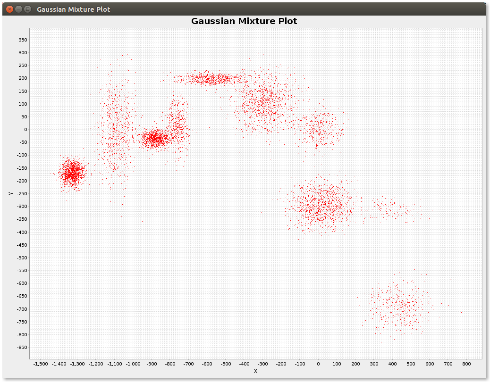
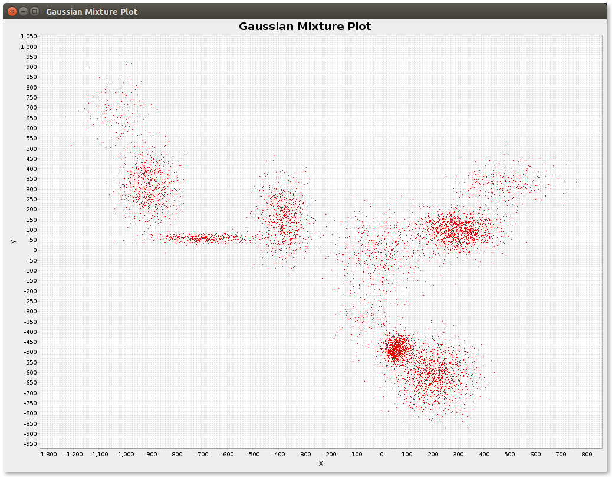
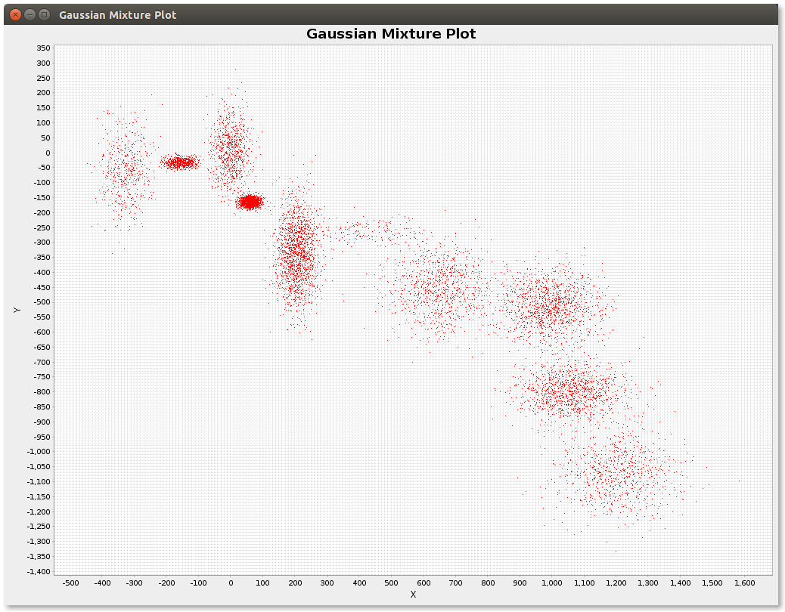
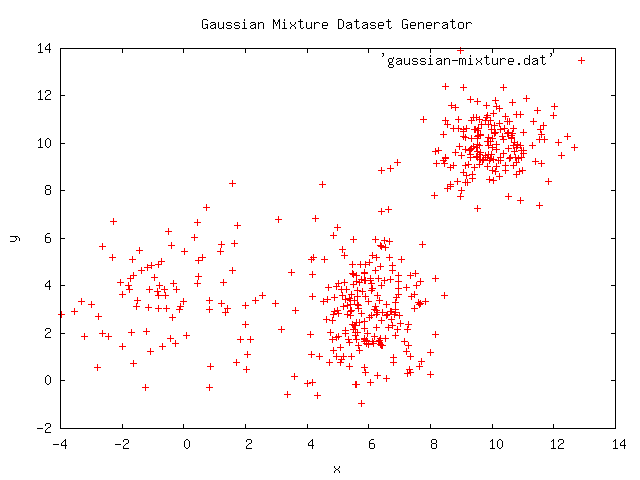

# Gaussian Mixture
Generate a stream of vectors according to a predefined mixture of gaussians.

The class also contains a builder that helps create a dataset using a few simple parameters (dimensionality, number of centers, overlap).

## Example using the builder

```java
import info.debatty.java.datasets.gaussian.Dataset;

public class GaussianMixtureBuilder {

    private static final int DIMENSIONALITY = 2;
    private static final int CENTERS = 10;
    private static final int SIZE = 10000;

    public static void main(String[] args) {
        Dataset dataset = new Dataset.Builder(DIMENSIONALITY, CENTERS)
                .setOverlap(Dataset.Builder.Overlap.MEDIUM)
                .varyDeviation(true)
                .varyWeight(true)
                .setSize(SIZE).build();

        for (Double[] vector : dataset) {
            // do something with your vector
        }
    }
}
```

This dataset will produce something like on following plots.







## Example with manual data centers

You can also manually define your centers.

```java
import info.debatty.java.datasets.reuters.*;

public class MyClass {
    public static void main(String[] args) {
        Dataset gaussian_mixture = new Dataset();
        gaussian_mixture.addCenter(
                new Center(
                        2,							// weight
                        new double[]{10.0, 10.0},	// center
                        new double[]{1.0, 1.0}));	// deviation

        gaussian_mixture.addCenter(
                new Center(
                        2,
                        new double[]{6.0, 3.0},
                        new double[]{1.0, 1.5}));

        gaussian_mixture.addCenter(
                new Center(
                        1,
                        new double[]{0.0, 4.0},
                        new double[]{2.0, 2.0}));

        Iterator<Double[]> iterator = gaussian_mixture.iterator();
        for (int i = 0; i < 500; i++) {
            println(iterator.next());
        }
    }

    private static void println(Double[] array) {
        for (Double value : array) {
            System.out.print("" + value + " ");
        }
        System.out.print("\n");
    }
}
```

Will produce something like

```
4.659833760799799 3.4363619496948736 
8.693042174471389 11.582794052352753 
10.736209908747439 9.67988698683881 
...
```

Which can be plotted with gnuplot:


